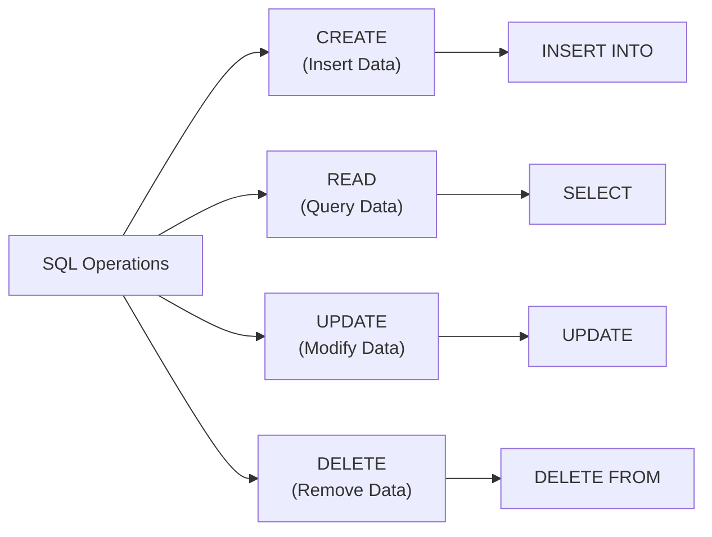

Here we have some basic actions we query on a **database table**:


## Get data from table
Will return all columns of all rows 
```sql
SELECT *
FROM <table_name>;
```


Will return all rows, but only these columns
```sql
SELECT <Column1>, <Column2>, <Column3>
FROM <table_name>;
```
The same but also changes the presented column name
```sql
SELECT <Column1> AS another_name1, <Column2>, <Column3> AS another_new_name
FROM <table_name>;
```

"WHERE" can filter what **Rows** we get back
```sql
SELECT *
FROM Orders 
WHERE ShipCountry = "Germany"
```


#todo add example
```sql
SELECT *
FROM Orders 
WHERE ShipCountry = "Germany"
ORDER BY ...
```

## Add new data to table

Basic usage:
```sql
INSERT INTO <TABLE_NAME>
VALUES (value1, value2, value3, ...)
```


---
## Exercises
Select the contact name, customer id, and company name of all Customers in London
```sql
SELECT ContactName, CustomerID, CompanyName
FROM Customers
WHERE City = 'London'
```

Marketing managers and sales representatives have asked you to select all available columns in the Suppliers tables that have a FAX number.
```sql
SELECT *
FROM Suppliers
WHERE Fax is not Null
```

```sql
SELECT *
FROM Customers
WHERE ContactTitle = "Owner" 
AND (Country = "Germany" OR Country = "Mexico" OR Country = "Sweden");
```


```python
int("12415325235")


int("12415safr5235")
```