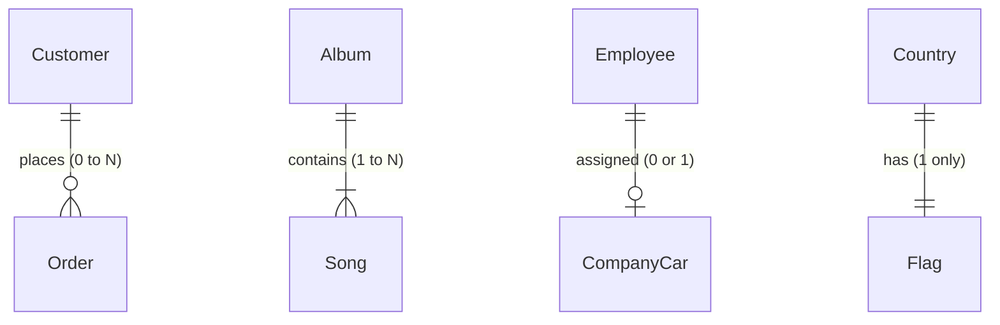

 

`order` -> `Customer`
- An order has to be assigned to exactly one `||` customer.
    - (There cant be an order without a customer)
    - (an order cannot be assigned to multiple customers)

 

`Customer` -> `order`
- A customer can have no orders/one order/many orders `0{` customer.

 
 
 
 

`Song` → `Album`
- Each Song must belong to exactly one Album `||`.

 

`Album` → `Song`
An Album must contain at least one Song, but can have many `|{`.
- An empty album with zero songs is not valid (business rule).
- Most albums contain multiple songs.

